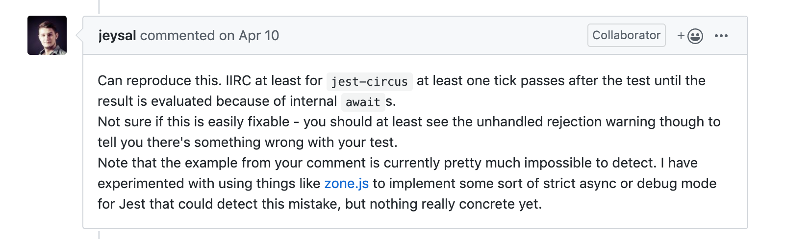
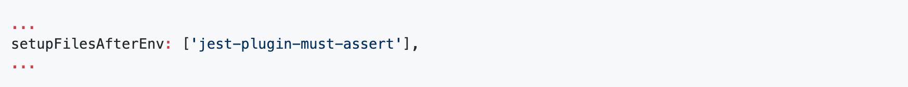
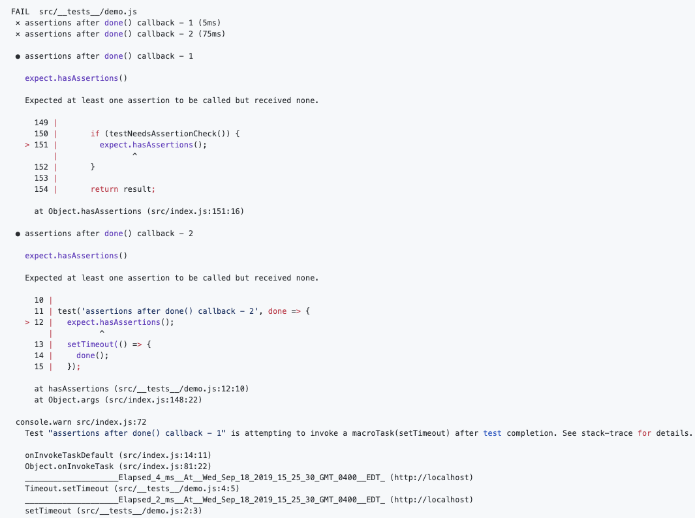

import { Appear, Image } from "mdx-deck";
import { Split, SplitRight } from "mdx-deck/layouts";
import { CodeSurfer } from "mdx-deck-code-surfer";
import { range } from "./helpers";

export { swiss as theme } from "mdx-deck/themes";

# Jest in strict mode

_Finding and preventing flaky tests_

---

# About

- @ballercat Twitter/GitHub
- Side projects, WebAssembly
- Wayfair
- Frontend Auxiliary Engineering
- Partner with other teams to build new UIs
- Education
- Pair programming/TDD

---

# Flaky tests are not useful

> "Non-deterministic tests have two problems, firstly they are useless, secondly they are a virulent infection that can completely ruin your entire test suite."

- Martin Fowler

---

# False positive tests are dangerous

- No obvious issues
- Potentially harmful code
- Breaks other tests
- Insanely difficult to track down
- How do help others avoid making mistakes?

---

# It's difficult to get tests _right_

- Trial and error to develop a "feel for it"
- Both for junior and senior devs
- Asynchronous logic is not intuitive
- No tooling to aid you along the way

---

<CodeSurfer
  title="Basic example"
  code={require("!raw-loader!./snippets/example-1.js").default}
  lang="javascript"
  dark={false}
  steps={[
    { notes: "The simplest of tests could lead to false positives" },
    { notes: "Why is this even a problem?" },
    { notes: "No assertions could be performed" }
  ]}
/>

---

<CodeSurfer
  title="yeah but no one writes tests like THAT"
  code={require("!raw-loader!./snippets/example-1.2.js").default}
  lang="javascript"
  dark={false}
  steps={[{ notes: "Sure we do" }]}
/>

---

<CodeSurfer
  title="just add expect.hasAssertions()"
  code={require("!raw-loader!./snippets/example-1.3.js").default}
  lang="javascript"
  dark={false}
  steps={[
    { notes: "Can be done by asserting on the length of the array" },
    { notes: "expect.hasAssertions() will catch the cases with no elements" },
    { notes: "Would be nice if there was a jest config option for this" }
  ]}
/>

---

# Not so fast

- Most test modules contain more than a single test
- Most useful tests involve async logic with React
- Async callbacks can and will escape a test!

---

<CodeSurfer
  title="Let's turn it up to 100"
  code={require("!raw-loader!./snippets/example-2.js").default}
  lang="javascript"
  dark={false}
  steps={[
    { notes: "What happens here?" },
    { notes: "https://github.com/facebook/jest/issues/8297" }
  ]}
/>

---

---

---

# What did we do about it?

- Stress about it, a lot
- Use the Zone.js library
- `jest-plugin-must-assert` patches the jest API
- Captures errand async callbacks, ensures assertions happen

---

# Add the plugin to your Jest config

---

---

# Conclusion

- Correct test results!
- Detects flaky and false positive tests
- Gives the developer immediate feedback on test quality
- Prevents new flaky tests from entering the system

---

# Source & Links

- https://github.com/ballercat/react-boston-talk
