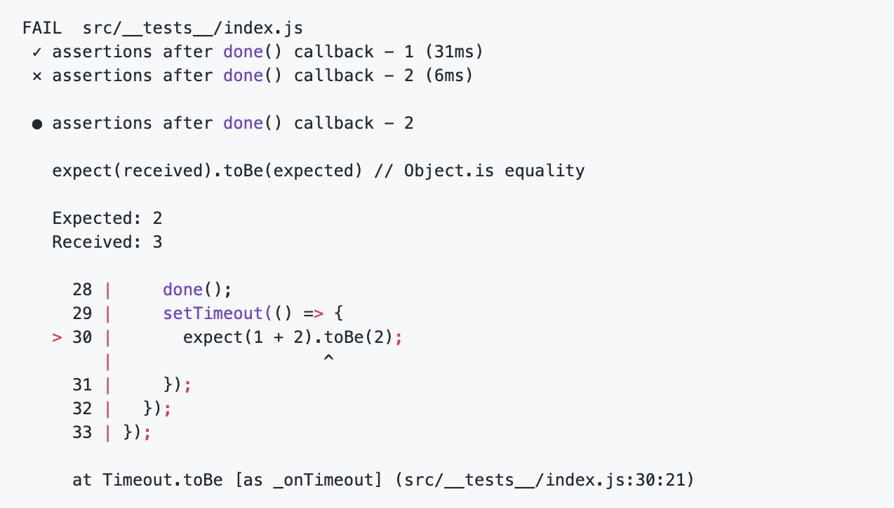

import { Appear, Image } from "mdx-deck";
import { Split, SplitRight } from "mdx-deck/layouts";
import { CodeSurfer } from "mdx-deck-code-surfer";
import { range } from "./helpers";

export { swiss as theme } from "mdx-deck/themes";

# Jest in strict mode

_Finding and preventing flaky tests_

---

# About Me

- Wayfair - Frontend Auxiliary Engineering
- Improve developer experience at Wayfair
- Help teams build new React Apps
- Education - Pair programming
- Lots of tests, TDD

---

# It's difficult to get tests _right_

- What makes a good React test?
- Code worth testing is complex
- Asynchronous logic is not intuitive
- Tooling can fall short

---

# Flaky tests are not useful

> "Non-deterministic tests have two problems, firstly they are useless, secondly they are a virulent infection that can completely ruin your entire test suite."

- Martin Fowler

---

# False positive tests are dangerous

- No obvious issues
- Potentially harmful code
- Breaks other tests
- Insanely difficult to track down

---

<CodeSurfer
  title="Basic example"
  code={require("!raw-loader!./snippets/example-1.js").default}
  lang="javascript"
  dark={false}
  steps={[
    { notes: "The simplest of tests could lead to false positives" },
    { notes: "Why is this even a problem?" },
    { lines: [3, 5], notes: "What if to results are returned" },
    { lines: [6], notes: "No assertions will be performed" }
  ]}
/>

---

<CodeSurfer
  title="yeah but no one writes tests like THAT"
  code={require("!raw-loader!./snippets/example-1.2.js").default}
  lang="javascript"
  dark={false}
  steps={[
    { notes: "Sure we do" },
    { lines: [4, 5], notes: "If no cards are found..." },
    { lines: [6], notes: "No assertions execute" },
    { notes: "In jest, if a test does not throw, it passes " }
  ]}
/>

---

<CodeSurfer
  title="add expect.hasAssertions()"
  code={require("!raw-loader!./snippets/example-1.3.js").default}
  lang="javascript"
  dark={false}
  steps={[
    { notes: "Can be done by asserting on the length of the array" },
    {
      lines: [2],
      notes: "expect.hasAssertions() will catch the cases with no elements"
    },
    {
      lines: [2],
      notes: "Would be nice if there was a jest config option for this"
    },
    { lines: [2], notes: "https://github.com/facebook/jest/issues/2209" },
    { notes: "Decided to write a plugin for this jest-plugin-must-assert" }
  ]}
/>

---

# Not so fast

- Originally just wanted to check for runtime assertions
- Most test modules contain more than a single test
- Most useful tests involve async logic with React
- Async callbacks can and will escape a test!

---

<CodeSurfer
  title="Not so simple after all"
  code={require("!raw-loader!./snippets/example-4.js").default}
  lang="javascript"
  dark={false}
  steps={[
    { notes: "Test, passes. Because assertion is counted" },
    { lines: [5], notes: "Assertion fails, but does not fail the test!" }
  ]}
/>

---

<CodeSurfer
  title="Let's turn it up to 100"
  code={require("!raw-loader!./snippets/example-2.js").default}
  lang="javascript"
  dark={false}
  steps={[
    { notes: "What happens here?" },
    { notes: "https://github.com/facebook/jest/issues/8297" }
  ]}
/>

---

---

---

<CodeSurfer
  title="But how?"
  code={require("!raw-loader!./snippets/example-2.js").default}
  lang="javascript"
  dark={false}
  steps={[
    { notes: "Let's see what happens" },
    { lines: [2], notes: "First setTimeout executes" },
    { lines: [3], notes: "The first test completes here, (it passes)" },
    { lines: [4], notes: "Another async task is scheduled" },
    {
      lines: [13],
      notes: "Next test starts running, we expect some assertions to run"
    },
    {
      lines: [14],
      notes: "Yet another async task is scheduled to end the second test"
    },
    {
      lines: [6],
      notes: "An assertion is executed from the old callback, 2nd test fails"
    },
    {
      lines: [15],
      notes: "The second test done() is invoked, ending the test"
    },
    {
      notes: "Jest is just trying to do it's best to fix a poor global API"
    }
  ]}
/>

---

# What do?

- Stress about it, a lot
- Use the Zone.js library

---

# Zone.js?

- Async context
- Can be used to "wrap" a function, like a test for example
- We can then intercept all async tasks

---

# jest-plugin-must-assert

- Wraps/patches the Jest API
- Captures errand async callbacks, ensures assertions happen
- If the test is active, async tasks continue, blocked otherwise
- Logs warnings to the console, with stack traces

---

# Using the plugin

---

# Demo

---

# Alternatives

- No global APIs
- The `avajs` approach

---

# Conclusion

- Correct test results!
- Detects flaky and false positive tests
- Gives the developer immediate feedback on test quality
- Prevents new flaky tests from entering the system

---

# References/Links

- This talk -> https://github.com/ballercat/react-boston-talk
- Jest plugin -> https://github.com/ballercat/jest-plugin-must-assert
- Zone.js -> https://github.com/angular/angular/tree/master/packages/zone.js
- Twitter/Github - @ballercat
